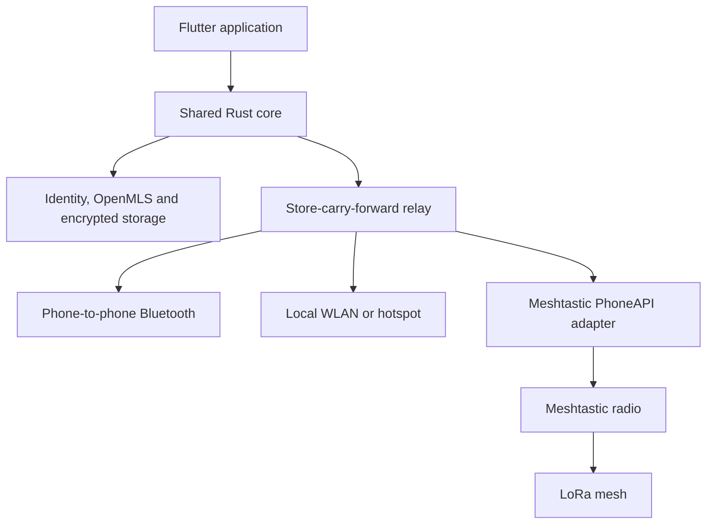

# Hybrid Offline Mesh Messenger — MVP Plan

## 1. Summary and architecture

Build an AGPL-3.0 emergency-messaging prototype supporting Android 10+, iOS 16+, Windows, macOS and Linux. It works without extra hardware over Bluetooth or shared/hotspot WLAN, with optional Meshtastic radios extending messages over LoRa.

- Use [OpenMLS](https://github.com/openmls/openmls), implementing RFC 9420, for both two-person conversations and groups.
- Treat direct conversations as two-member MLS groups; private groups support up to 16 members.
- Meshtastic radios carry already-encrypted payloads through `PRIVATE_APP`; radio firmware and channel encryption are not trusted for confidentiality.
- Phones use store-carry-forward: they temporarily carry unreadable envelopes for unknown users under strict quotas.
- Community gateways bridge BLE/WLAN and LoRa while remaining unable to decrypt messages.
- No server, account, internet transport, browser client or custom radio firmware in the MVP.

## 2. Public interfaces and protocol

### Shared Rust core

Expose these operations to Flutter through `flutter_rust_bridge`:

- `IdentityService`: create/import identity, issue device credentials, produce QR contact cards, revoke devices.
- `ConversationService`: create direct chats and groups, manage membership, send/decrypt messages.
- `RelayService`: ingest, deduplicate, expire, synchronize and forward envelopes.
- `Transport`: `start`, `stop`, `capabilities`, `send_frames` and asynchronous incoming-event stream.
- `RadioService`: discover, connect and configure supported Meshtastic devices.
- `CoreEvent`: message state, peer encounter, radio state, revocation, group resynchronization and storage warnings.

### Identity and encryption

- Generate a 256-bit offline recovery secret, encoded as a 24-word recovery code.
- Derive an Ed25519 root identity; root-sign each device credential.
- Remove the recovery secret from the device after setup confirmation.
- Store device and MLS keys inside a SQLCipher database whose wrapping key comes from Keychain, Android Keystore, Windows Credential Manager or macOS Keychain. Linux uses Secret Service with a passphrase fallback.
- QR contact cards contain the root public key, device certificate and one-time MLS key package.
- Show a human-comparable safety number after pairing.
- Use the standard MLS X25519/Ed25519/AES-GCM cipher suite.
- Retain at most three previous MLS epochs or seven days of delayed-message keys, whichever expires first.
- Wrap complete MLS messages again so relays cannot see MLS group IDs or epochs.
- Derive opaque routing tags from a separate conversation routing secret; rotate them every six hours.
- Recovery restores identity and revocation authority, not message history. Contacts must establish fresh MLS sessions after accepting the replacement-device certificate.

### Relay envelope

Use a versioned compact binary envelope containing:

- Protocol version and 128-bit envelope ID
- Rotating 128-bit routing tag
- Created-time bucket and expiry
- Hop budget and fragment metadata
- Ciphertext length and proof-of-work nonce
- Padded, authenticated ciphertext

Defaults:

- User text: maximum 512 UTF-8 bytes
- Complete encrypted envelope: maximum 4 KiB
- LoRa frame payload: maximum 180 bytes, padded and fragmented
- User-message expiry: 24 hours
- MLS control/revocation expiry: seven days
- Relay cache: 50 MiB or 10,000 envelopes
- Unknown-envelope admission: 18-bit proof of work
- Per-peer synchronization: at most 256 new envelopes or 1 MiB per session
- Duplicate suppression by envelope ID; malformed or expired fragments are discarded

### Transport behavior

- **Bluetooth:** custom GATT service, rotating advertisement identifier, encrypted Noise NN synchronization session and resumable framing.
- **WLAN:** mDNS discovery plus Noise-protected TCP synchronization on shared networks and phone hotspots.
- **LoRa:** Meshtastic PhoneAPI over mobile BLE or desktop serial/TCP, using `PRIVATE_APP`, three-hop pilot limit and EU 868 MHz configuration.
- Gateways forward each envelope once per transport and use the common ID to prevent loops.
- No names, contact identifiers or stable identity keys appear in discovery advertisements.

## 3. MVP features and technical work

### User features

- Guided identity creation, recovery-code confirmation and app locking
- QR contact exchange and safety-number verification
- Encrypted direct text messaging
- Invitation-only groups of up to 16 members
- Single group owner controls additions and removals; owner succession is post-MVP
- Queued, relayed, delivered and expired states for direct messages
- Group messages show accepted-by-mesh status without per-member/read receipts
- Nearby-connectivity and optional-radio status
- Meshtastic discovery, connection and EU-region validation
- Relay enable/disable, storage usage and cache clearing
- Device-revocation and replacement flow
- Seven-day local message history plus immediate conversation deletion
- Local notifications and redacted diagnostic export

Explicitly exclude attachments, voice, public channels, location, cloud backup, usernames, internet fallback, browser access and continuous iOS background-routing guarantees.

### Engineering tasks

1. Create a monorepo containing the Flutter app, Rust core, generated protocol bindings, transport adapters, simulator and integration tests.
2. Pin Flutter/Rust toolchains; add CI for all five target operating systems, dependency auditing, SBOM generation and signed build artifacts.
3. Implement identity creation, recovery, root-signed device certificates, QR serialization and revocation beacons.
4. Integrate OpenMLS, two-person conversations, 16-member groups, epoch retention and encrypted persistence.
5. Implement the outer envelope, routing-tag rotation, fragmentation, proof of work, quotas and expiry.
6. Build a deterministic network simulator supporting partitions, delay, duplication, loss, malicious mutation and flooding.
7. Implement WLAN synchronization, followed by BLE discovery/GATT synchronization and platform lifecycle handling.
8. Implement Meshtastic protobuf/PhoneAPI integration without copying firmware code; retain required GPL notices.
9. Add LoRa fragmentation, acknowledgements, bounded retry scheduling and BLE/WLAN-to-LoRa gateway mode.
10. Build Flutter onboarding, contact, chat, group, radio, relay, recovery and diagnostics screens.
11. Add secure release logging: no analytics, telemetry, plaintext logs, identifiers or keys.
12. Document the threat model, radio limitations, recovery limitations and prohibition on operational reliance before review.

## 4. Roadmap

Assume one human developer working with Codex.

- **Weeks 1–2 — Foundation:** architecture decisions, protocol specification, threat model, repository, CI, simulator skeleton and acquisition of reference radios.
- **Weeks 3–7 — Secure core:** identity/recovery, encrypted database, OpenMLS integration, envelope codec, quotas and comprehensive core tests.
- **Weeks 8–12 — Application:** Flutter shell, onboarding, direct chats, groups, revocation and simulated transport.
- **Weeks 13–17 — Hardware-free network:** WLAN and BLE transports, encounter synchronization, relay cache, Android background service and best-effort iOS lifecycle support.
- **Weeks 18–22 — LoRa integration:** Meshtastic BLE/serial/TCP adapter, fragmentation, retries, gateway mode and EU 868 validation.
- **Weeks 23–26 — Lab demonstration:** adversarial testing, battery and soak tests, cross-platform packaging, documentation and reproducible demo procedure.
- **After MVP:** closed field pilot, Wi-Fi Aware evaluation, group-owner recovery, independent cryptographic review and radio field testing.
- **Before public beta:** resolve review findings, commission a penetration test, add signed/reproducible releases and complete regulatory and abuse documentation.

Reference radios: LILYGO T‑Echo and RAK4631 as primary low-power targets, plus one ESP32/SX1262 Meshtastic device for compatibility.

## 5. Acceptance criteria and tests

### Functional demonstration

- Android and iOS exchange encrypted messages over BLE with no WLAN, internet or radio.
- All clients exchange messages over a shared WLAN or phone hotspot.
- A message travels A → courier B → C even though A and C are never simultaneously connected.
- A mixed route succeeds across phone BLE, WLAN gateway and a three-hop LoRa mesh.
- Direct messages survive disconnection, duplication, reordering and app restart without duplicate UI entries.
- A 16-member group handles offline members, delayed messages, member removal and epoch changes.
- Recovery code creates a replacement device, publishes a signed revocation and prevents a revoked non-owner device from receiving messages after the removal commit.
- Installable builds run on Android 10, iOS 16, current Windows, current macOS and Ubuntu LTS.

### Security and abuse resistance

- Packet captures and relay databases contain no plaintext, display names, stable discovery IDs or MLS group identifiers.
- Modified ciphertext, forged certificates, replayed envelopes and invalid fragments are rejected.
- A malicious relay cannot impersonate a contact or group member.
- Flooding cannot exceed configured session, storage or expiry limits.
- Database extraction while the app is locked does not expose messages or device keys.
- A compromised old MLS epoch cannot decrypt messages after its retention window.
- Tests explicitly document that an unlocked captured phone, radio detection, timing analysis and jamming remain outside cryptographic protection.

### Reliability and performance

- WLAN delivery: p95 under five seconds in a 100-message test.
- BLE delivery within ten metres: p95 under fifteen seconds.
- Store-carry-forward delivery: p95 under thirty seconds after the courier encounters the recipient.
- Controlled three-hop LoRa test with 10% injected loss: at least 95% of 160-byte messages delivered within five minutes.
- Eight-hour relay soak test produces no crash, unbounded storage growth or duplicate conversation messages.
- Mobile active-relay battery loss remains under 20% during the eight-hour reference test; results are reported separately for Android and iOS.

### Test suite

- Unit and known-answer tests for encoding, identity validation, expiry and MLS operations
- Property tests for fragmentation, reassembly, deduplication and quota invariants
- Fuzzing for envelope, QR, BLE and Meshtastic parsers
- Simulations of partitions, clock errors, dropped commits and relay flooding
- Cross-platform interoperability tests using identical protocol fixtures
- Physical-radio tests on all three reference hardware families
- Static dependency/license scans and release-build secret/log inspection

### Assumptions

- The milestone is a lab demonstration, not a safety-certified or high-risk operational release.
- EU 868 MHz is the only pilot radio region.
- The selected desktop applications replace ordinary browser support for the MVP.
- OpenMLS and standard cryptographic libraries are used unchanged; no novel cipher or key exchange is introduced.
- AGPL-3.0 applies to project code, with third-party notices and GPL compatibility reviewed before distribution.
